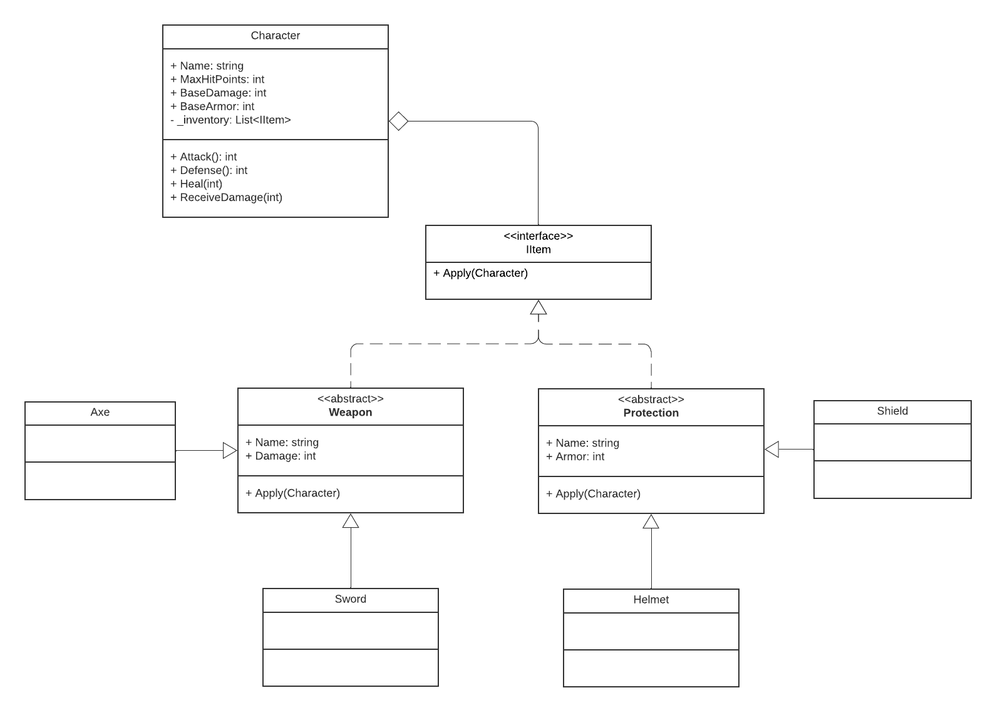

# I.E.S. Rafael Alberti
# Programación de servicios y procesos 24-25
## Pruebas inciales C#

Proyecto resolviendo la prueba inicial del módulo Programación de Servicios y procesos.

Como referencia, este diagrama de clases se debe implementar en C#:

## Resolución

En la carpeta PruebaInicial están las definiciones de las clases del diagrama: [Character](./PruebaInicial/Character.cs), [IItem](./PruebaInicial/IItem.cs), [Weapon](./PruebaInicial/Weapon.cs), [Protection](./PruebaInicial/Protection.cs), [Axe](PruebaInicial/Axe.cs), [Sword](PruebaInicial/Sword.cs), [Helmet](PruebaInicial/Helmet.cs), [Shield](PruebaInicial/Shield.cs).

## Test unitarios

El proyecto PruebaInicial.Tests define los [test unitarios](PruebaInicial.Tests/CharacterTest.cs) que se ejecutarán para comprobar el funcionamiento de nuestro sistema.

## GitHub Actions

El archivo [dotnet-desktop.yml](.github/workflows/dotnet-desktop.yml) define las acciones tras cada push al repositorio, incluyendo en este caso la ejecución de los test unitarios.

Esta acción genera un 'badge' (insignia) que se actualiza con su estado:

